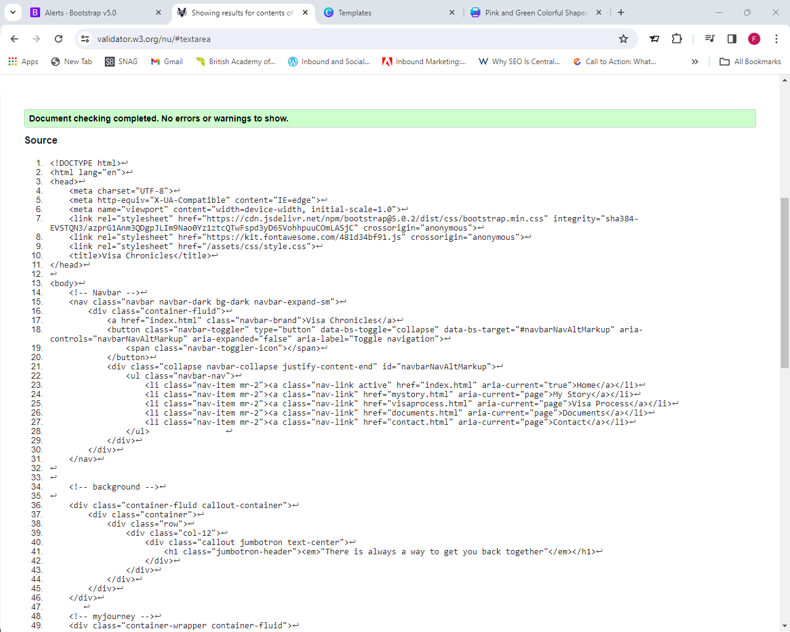
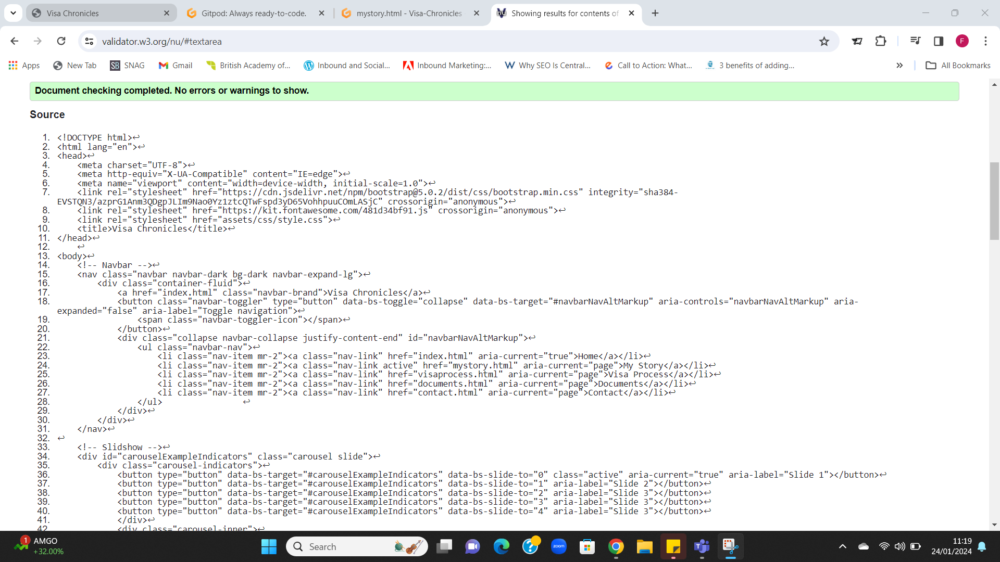
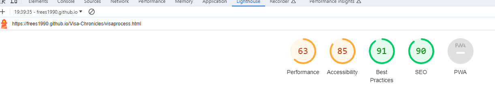
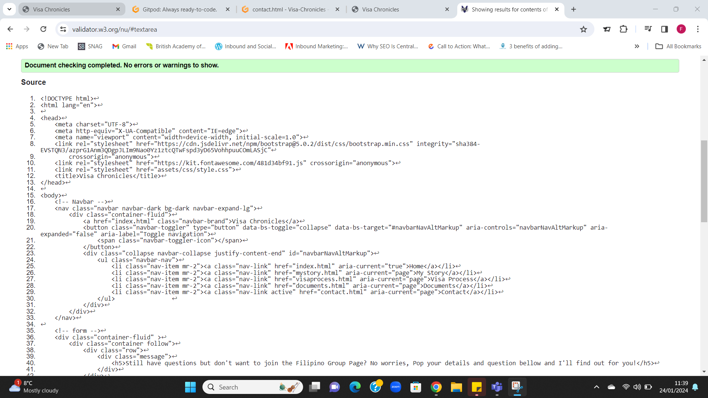

# Visa Chronicles

### Welcome to Visa Chronicles!

This website is a blog guide for spouse visa applicants for the UK. The website has a easy navigation which aims user to get all the information they need to process their Spouse Visa. 

...! This is where I put the photo of my web design...

## Table of Contents

- [Visa Chronicles](#visa-chronicles)
  - [Table of Contents](#table-of-contents)
  - [**UX**](#ux)
    - [**Site Purpose**](#site-purpose)
    - [**Site Goal**](#site-goal)
    - [**Current User Goal**](#current-user-goal)
    - [**New User Goal**](#new-user-goal)
    - [**Communication**](#communication)
  - [**Design**](#design)
    - [**Wireframe**](#Balsamiq)
    - [**Colour Palette**](#colour-palette)
    - [**Typography**](#typography)
    - [**Images**](#images)
  - [**Features**](#features)
    - [**Language Used**](#language-used)
    - [**Navigation Bar**](#navigation-bar)
    - [**Landing Page**](#landing-page)
    - [**Footer**](#footer)
    - [**Future Features**](#future-features)
  - [**Testing**](#testing)
    - [**HTML Validatior Test**](#html-validatior-test)
    - [**CSS Validator Test**](#css-validator-test)
    - [**Lighthouse Mobile**](#lighthouse-mobile)
    - [**Lighthouse Desktop**](#lighthouse-desktop)
    - [**Website Functions**](#website-functions)
    - [**Libraries and Progransms used**](#libraries-and-progransms-used)
  - [**Deployment \& Usage**](#deployment--usage)
    - [**Deployment**](#deployment)
    - [**How to Fork**](#how-to-fork)
    - [**How to Clone**](#how-to-clone)
  - [**Credits**](#credits)
    - [**Media**](#media)

## **UX**

### **Site Purpose**

### Website Purpose:
#### What For:
This Website is a blog website that provides information about the Process of applying for a spouse visa to the UK. It provides general information on the process and as well as my own personal experience processing the visa. 
-	My Story Page – Provides detailed information on what I went through and what documents I have provided to Home office to satisfy the requirement outlined. 
-	Visa Process Page – Provides General Information and steps on how to acquire Spouse Visa, they might find my visa journey a little bit or a lot different to what they might go through. 

I can be a little bit confusing and daunting browsing through multiple immigration website and as well as Gov.UK.  But with the help of my website they will find key information on what to do first and what to prepare. 

#### Who For: 
The website is for my fellow Filipinos who are confused with the process of their spouse visa application. 

### **Site Goal**

My Goal is to provide a usuable guide for all my fellow Filipinos who are seeking assistance for their spouse visa. This site can also be used as guide for other nationalities as the website itself has a page which provides general information with tips and direct links to Home Office Guidelines. 

### **Current User Goal**
- Links to website on where to fill the application forms.
- links to show where they can submit their application documents and get your Biometrics done.
- Video, that shows how to fill the form.
- Contact Informtion for Legal Representation if they need one. 
- Contact Us

### **New User Goal**
A fully working Contact Page which they can send me their questions tregarding the visa process

### **Communication**
Since this a blog of my own personal experience which aims to help people with their visa application. I am focused on a simple website that uses easy on the eyes shades. I have added a video on the process page to provide visual learners a choice.

## **Design**

### **Wireframe**
 
### **Colour Palette**
- Body 
  - background-color: #dcf3ef
- Navbar 
  - Original Bootstrap Navbar-Dark
- jumbotron-header 
  - color: white 
- rounded-image 
  - border-color: #0b0909;
- quote 
  - color: #0f0f0f;
- GOV 
  - color: #0a776e;
- btn-primary, btn-lg active 
  - background-color: #473346;
- h2 , i
  - color: #3a2c39
- i:hover
  - color: #8b07bb;
- copyright
  - background: #0f0f0f;
  - color: #FFF; 
- .FLRM , .ILR , .financial-req, 
.accommodation-req, .e-l-req, .TB-test, .TestCenter,
.Housing-act, .contact, .facebook
  - color:#19b91b;

- .FLRM:hover , .ILR:hover , .financial-req:hover, 
.accommodation-req:hover, .e-l-req:hover, .TB-test:hover,
.TestCenter:hover, .Housing-act:hover, .sites:hover, .contact:hover, .facebook:hover
  - color:#8b07bb;
- sites
  - color:#c81f1f;

### **Typography**
Fair Play and Sans-Serif 

### **Images**
Home Page:
- Shuttershock (Paid Subscription)
- A Photo of me ( To present myself as the blogger)

My Story Page:
- Personal Photos of my Family
  - This page is my own personal experience on the visa process and I thought adding photos of my family would be a great way to show family life in the UK. 

## **Features**
 - Responsive on all device sizes

 - Interactive elements

### **Language Used**
  - English
  - Tagalog
  - Cebuano / Bisaya

### **Navigation Bar**

### **Landing Page**

### **Footer**

### **Future Features**

## **Testing**

### **HTML Validatior Test**
  
  
  
  

### **CSS Validator Test**

### **Lighthouse Mobile**

### **Lighthouse Desktop**

### **Website Functions**

## **Libraries and Programs used**
- Bootstrap 5.0
- Github: Store Repository
- Gitpod: To create the html and css file
- Google Fonts: Font family "Playfair", sans-serif;
- ev Tools: For styling and lighthouse
- Font Awesome: Dropdown menu icon
- UI.DEV: Responsive screenshots of the final project for the README file

## **Deployment & Usage**

### **Deployment**

### **How to Fork**

### **How to Clone**

## **Credits**

### **Media**
  

