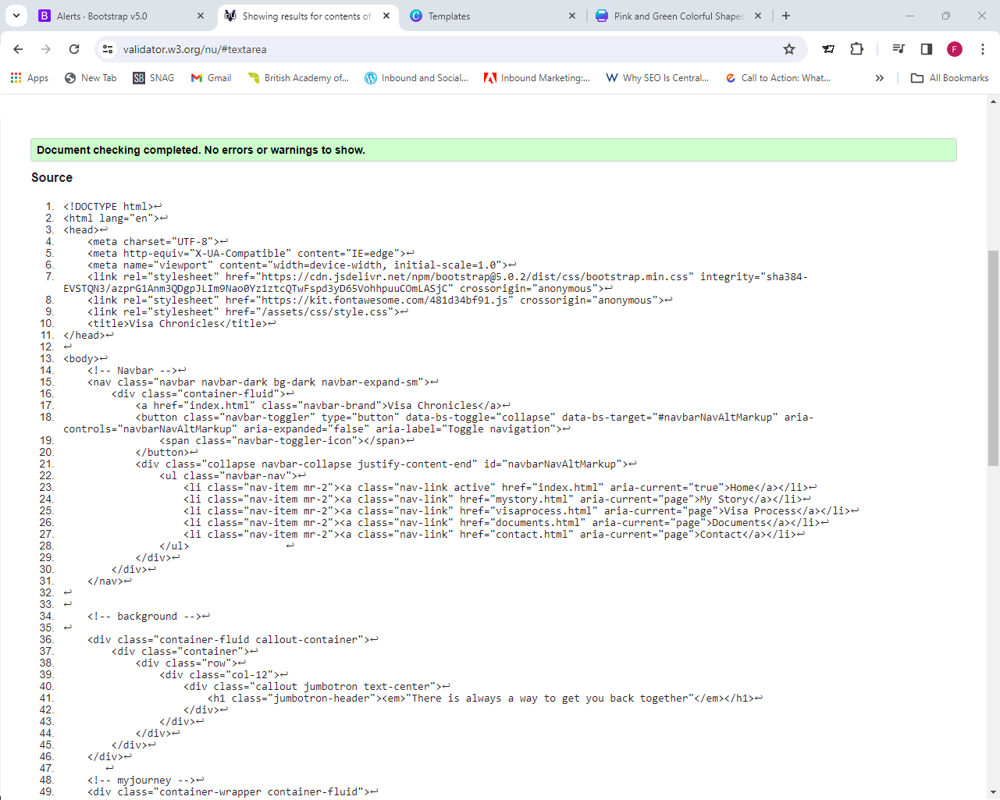
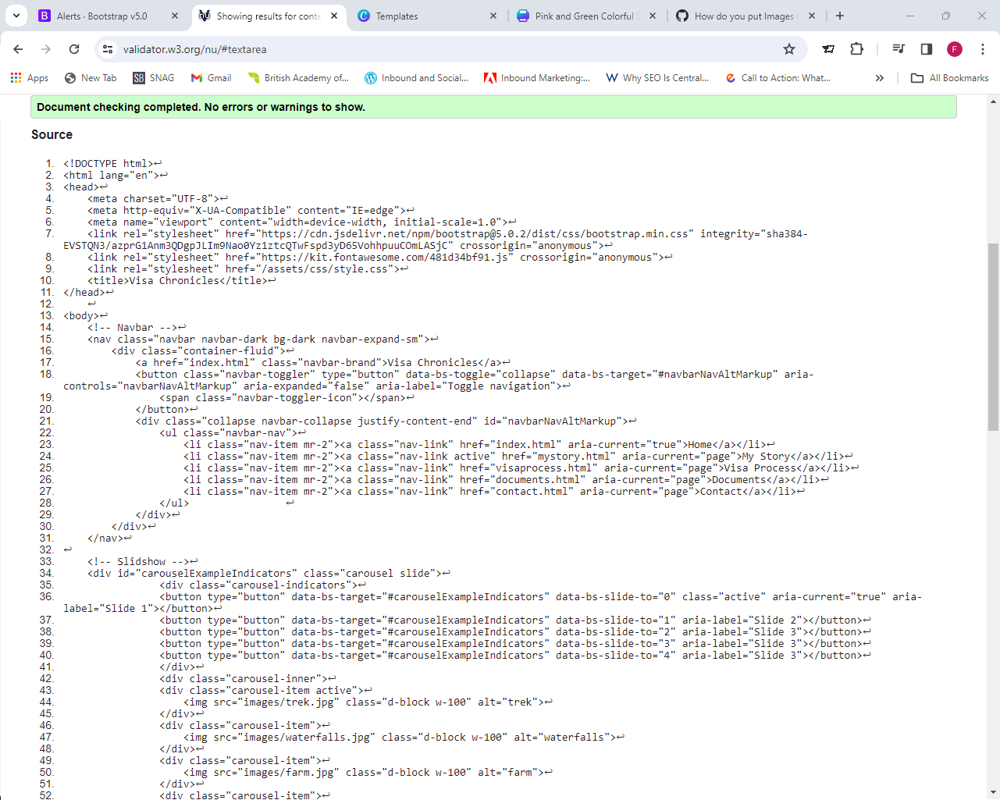
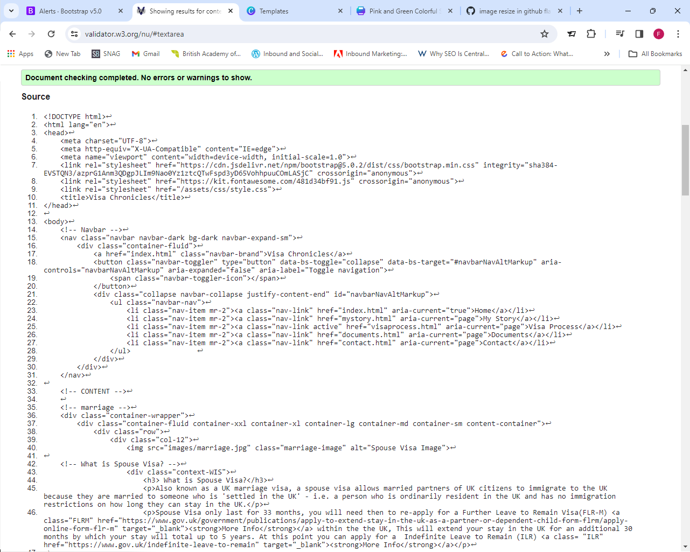
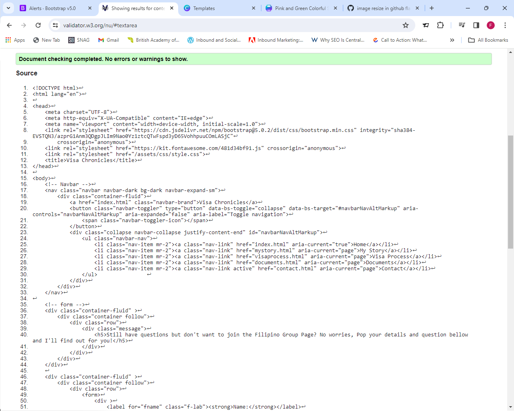

# Visa Chronicles

My aim for this website is to help my fellow Filipino Citizen Mena and Women obtain their Spouse Visa to reunite to the person they love. Obtaining a spouse visa can be a tedious and heartbreaking process but would all be worth it in the end. I am hoping that this website will be a helpful guide for interacial couple go through the process of their Visa Application smoothly and to also prepare them to the life in UK.

...! This is where I put the photo of my web design...

## Table of Contents

- [Visa Chronicles](#visa-chronicles)
  - [Table of Contents](#table-of-contents)
  - [**UX**](#ux)
    - [**Site Purpose**](#site-purpose)
    - [**Site Goal**](#site-goal)
    - [**Audience**](#audience)
    - [**Current User Goal**](#current-user-goal)
    - [**New User Goal**](#new-user-goal)
    - [**Communication**](#communication)
  - [**Design**](#design)
    - [**Balsamiq**](#Balsamiq)
    - [**Colour Palette**](#colour-palette)
    - [**Typography**](#typography)
    - [**Images**](#images)
  - [**Features**](#features)
    - [**Language Used**](#language-used)
    - [**Navigation Bar**](#navigation-bar)
    - [**Landing Page**](#landing-page)
    - [**Footer**](#footer)
    - [**Future Features**](#future-features)
  - [**Testing**](#testing)
    - [**HTML Validatior Test**](#html-validatior-test)
    - [**CSS Validator Test**](#css-validator-test)
    - [**Lighthouse Mobile**](#lighthouse-mobile)
    - [**Lighthouse Desktop**](#lighthouse-desktop)
    - [**Website Functions**](#website-functions)
  - [**Libraries and Progransms used**](#libraries-and-progransms-used)
  - [**Deployment \& Usage**](#deployment--usage)
    - [**Deployment**](#deployment)
    - [**How to Fork**](#how-to-fork)
    - [**How to Clone**](#how-to-clone)
  - [**Credits**](#credits)
    - [**Media**](#media)

## **UX**

### **Site Purpose**

This website are for my fellow Filipino's Men and Women who are seeking for information and guide on how to process a Spouse Visa to the UK.

### **Site Goal**

This site provides a relatively easier and step by step guide for Spouse Visa Application.

### **Audience**

My target audience are people from my country of origin.

### **Current User Goal**
- Links to website on where to download the application forms.
- Maps to show where they can submit their application forms.
- Video, that shows the process of the application.
- Contact Us
### **New User Goal**

### **Communication**

Since this a blog of my own personal experience which aims to help people with their visa application. I am focused on a simple website that uses easy on the eyes shades. I have added a video on the process page to provide visual learners a choice and as well a downloadable template if they choose to have something to read.

## **Design**

### **Balsamiq**
  - Desktop view
    - https://balsamiq.cloud/suyddyd/pxtmatu/rCE79
  - Mobile view
    - https://balsamiq.cloud/suyddyd/pmtg4oi/r7DFF

### **Colour Palette**
- Body 
  - background-color: #dcf3ef
- Navbar 
  - Original Bootstrap Navbar-Dark
- jumbotron-header 
  - color: white 
- rounded-image 
  - border-color: #0b0909;
- quote 
  - color: #0f0f0f;
- GOV 
  - color: #0a776e;
- btn-primary, btn-lg active 
  - background-color: #473346;
- h2 , i
  - color: #3a2c39
- i:hover
  - color: #8b07bb;
- copyright
  - background: #0f0f0f;
  - color: #FFF; 
- .FLRM , .ILR , .financial-req, 
.accommodation-req, .e-l-req, .TB-test, .TestCenter,
.Housing-act, .contact, .facebook
  - color:#19b91b;

- .FLRM:hover , .ILR:hover , .financial-req:hover, 
.accommodation-req:hover, .e-l-req:hover, .TB-test:hover,
.TestCenter:hover, .Housing-act:hover, .sites:hover, .contact:hover, .facebook:hover
  - color:#8b07bb;
- sites
  - color:#c81f1f;

### **Typography**
@import url('https://fonts.googleapis.com/css2?family=Fira+Sans:ital,wght@0,100;0,200;0,300;0,400;0,500;0,600;0,700;0,800;0,900;1,100;1,200;1,300;1,400;1,500;1,600;1,700;1,800;1,900&family=Lato:ital,wght@0,100;0,300;0,400;0,700;0,900;1,100;1,300;1,400;1,700;1,900&family=Oswald:wght@435&family=Playfair+Display:ital,wght@0,500;0,600;0,700;0,800;0,900;1,400;1,500;1,600;1,700;1,800;1,900&family=Rubik+Doodle+Shadow&family=Ubuntu:ital,wght@0,300;0,400;0,500;0,700;1,300;1,400;1,500;1,700&display=swap');

### **Images**

## **Features**

### **Language Used**
  - English
  - Tagalog
  - Cebuano / Bisaya

### **Navigation Bar**

### **Landing Page**

### **Footer**

### **Future Features**

## **Testing**

### **HTML Validatior Test**
  
  
  
  

### **CSS Validator Test**

### **Lighthouse Mobile**

### **Lighthouse Desktop**

### **Website Functions**

## **Libraries and Programs used**
- Github: Store Repository
- Gitpod: To create the html and css file
- Google Fonts: Font family "Playfair", sans-serif;
- ev Tools: For styling and lighthouse
- Font Awesome: Dropdown menu icon
- UI.DEV: Responsive screenshots of the final project for the README file

## **Deployment & Usage**

### **Deployment**

### **How to Fork**

### **How to Clone**

## **Credits**

### **Media**
  

[def]: #Balsamiq