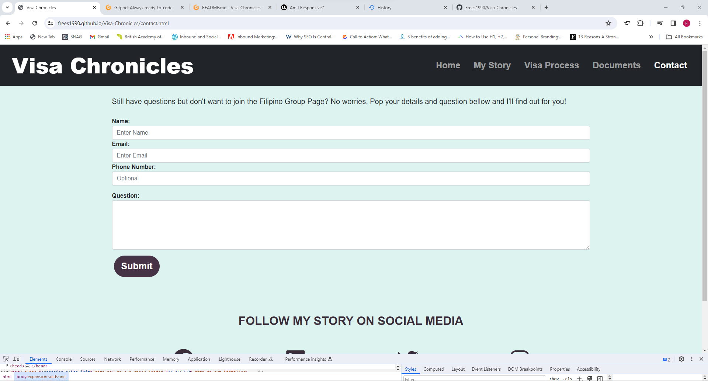
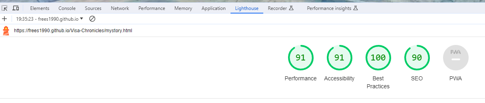

# Visa Chronicles

### Welcome to Visa Chronicles!

This website is a blog guide for spouse visa applicants for the UK. The website has a easy navigation which aims user to get all the information they need to process their Spouse Visa. 

## Table of Contents

- [Visa Chronicles](#visa-chronicles)
  - [Table of Contents](#table-of-contents)
  - [**UX**](#ux)
    - [**Site Purpose**](#site-purpose)
    - [**Site Goal**](#site-goal)
    - [**Current User Goal**](#current-user-goal)
    - [**New User Goal**](#new-user-goal)
    - [**Communication**](#communication)
  - [**Design**](#design)
    - [**Wireframe**](#Balsamiq)
    - [**Colour Palette**](#colour-palette)
    - [**Typography**](#typography)
    - [**Images**](#images)
  - [**Features**](#features)
    - [**Language Used**](#language-used)
    - [**Navigation Bar**](#navigation-bar)
    - [**Landing Page**](#landing-page)
    - [**Footer**](#footer)
    - [**Future Features**](#future-features)
  - [**Testing**](#testing)
    - [**HTML Validatior Test**](#html-validatior-test)
    - [**CSS Validator Test**](#css-validator-test)
    - [**Lighthouse Mobile**](#lighthouse-mobile)
    - [**Libraries and Progransms used**](#libraries-and-progransms-used)
  - [**Deployment & Usage**](#deployment--usage)
    - [**Deployment**](#deployment)
  - [**Credits**](#credits)
    - [**Media**](#media)

## **UX**

### **Site Purpose**

### Website Purpose:
#### What For:
This Website is a blog website that provides information about the Process of applying for a spouse visa to the UK. It provides general information on the process and as well as my own personal experience processing the visa. 
-	My Story Page – Provides detailed information on what I went through and what documents I have provided to Home office to satisfy the requirement outlined. 
-	Visa Process Page – Provides General Information and steps on how to acquire Spouse Visa, they might find my visa journey a little bit or a lot different to what they might go through. Reason why I created the Visa Process page to give them the General guideline to process their visa. 

I can be a little bit confusing and daunting browsing through multiple immigration website and as well as Gov.UK.  But with the help of my website they will find key information on what to do first and what to prepare. 

-Links to Filipino Group and Contact Page, not everybody has the same circumstances so we have a Facebook Page group that they can join and post any questions about the visa. We have over 3,000 members who mnight be able to answer their specific inquiry. I made a separate contact page that currently is not working at the moment and will be soon when I get through the JAVASCRIPT module. This page is made for people who are uncomfortable asking questions to the public. They can send me their questions, I might be able to know, probably not but I would certainly be able to represent them in the page if needs to be. 

#### Who For: 
The website is for my fellow Filipinos who are confused with the process of their spouse visa application. 

### **Site Goal**

My Goal is to provide a usuable and easy to navigate guide for all my fellow Filipinos who are seeking assistance for their spouse visa. This site can also be used as guide for other nationalities as the website is written in English and has a page which provides general information with tips and direct links to Home Office Guidelines. 

### **Current User Goal**
- Links to website on where to fill the application forms.
- links to show where they can submit their application documents and get your Biometrics done.
- Video, that shows how to fill the form.
 Note: This walkthrough video is very usefull to everyone becuase the form can be a litte tricky and confusing. This video is not made by me but was recommended by the Filipino community as this was made by a Solicitor who practice immigration law. 
- Contact Us

### **New User Goal**
A Fully working Contact Page which they can send me their questions regarding the visa process (This will be fullfilled during my 2nd milestone project which covers Javascript)

### **Communication**
The site is a Blog created mainly for guidance, I didnt worry to much about the design but focused on the content and how user friendly the site will be. I have chosen a basic structure that is easy to navigate and understand. 

## **Design**

### **Wireframe**
My wireframe may differ from the final outcome. 

### WEBPAGE VIEW
  
  
  
  
  

### MOBILE VIEW
  
  
  
  
  

 
### **Colour Palette**
- Body 
  - background-color: #dcf3ef
- Navbar 
  - Original Bootstrap Navbar-Dark
- jumbotron-header 
  - color: white 
- rounded-image 
  - border-color: #0b0909;
- quote 
  - color: #0f0f0f;
- GOV 
  - color: #0a776e;
- btn-primary, btn-lg active 
  - background-color: #473346;
- h2 , i
  - color: #3a2c39
- i:hover
  - color: #8b07bb;
- copyright
  - background: #0f0f0f;
  - color: #FFF; 
- .FLRM , .ILR , .financial-req, 
.accommodation-req, .e-l-req, .TB-test, .TestCenter,
.Housing-act, .contact, .facebook
  - color:#19b91b;

- .FLRM:hover , .ILR:hover , .financial-req:hover, 
.accommodation-req:hover, .e-l-req:hover, .TB-test:hover,
.TestCenter:hover, .Housing-act:hover, .sites:hover, .contact:hover, .facebook:hover
  - color:#8b07bb;
- sites
  - color:#c81f1f;

### **Typography**
Playfair and Sans-Serif 

### **Images**
#### Home Page:
- Shuttershock (Paid Subscription)
- A Photo of me ( To present myself as the blogger)

#### My Story Page:
- Personal Photos of my Family
  - This page is my own personal experience on the visa process and I thought adding photos of my family would be a great way to show family life in the UK. 

#### Visa Process Page:
- Shuttershock (Paid Subscription)
- Video (Permission from happyvisas.com)

## **Features**
### NAVIGATION BAR ON ALL PAGES WITH ACTIVE HIGHLIGHT
  

   -  I think the most important thing about a website is the navigation bar, to me it should not be complicated to use it and it should be visible with easy to the eyes color. My navbar turns into a toggle button when the screen size go smaller. The Navigation bar also highlights what page the user is currently in. 

### SHORT DESCRIPTIVE TEXT ABOUT THE SITE AND PHOTO OF THE CONTENT CREATOR

  

   -  As a user one thing that attracts me to use a website is a short homepage with a short description of what it is all about. To me when the home page is too long and too wordy, it is already a turn off form me. This may differ to different people so this is only base on my personal preference. The photo I think adds a personal touch. 

### SOCIAL LINKS

  

  - In this day and age, Social Media is everywhere and 99% of the population probably has one, so having social links on all pages of your website not only makes your website look aesthestically pleasing but as well as it could help users find your easier. Especially when you are offering services. 

### CAROUSEL
    
  

  - I Carousel makes your website look interesting and fun to look at. 

### WORKING LINKS
  

  - All my pages are linked to website of important information, having a fully working links is healpful especially to users who are looking for information. 

### VIDEO
  

  - Videos on a website is quite helpful, especially for audiences who prefers directive audio and visual instructions rather than written. 

### DOWNLOADABLE PDF LINK
  

  - Having a Link that you can download pdf files are very important when it comes to websites that provide information. 

  ### CONTACT PAGE 
  

  - Contact Pages I think is one of the most usefukl pages in a website, it provides user comfort that they can reach out to someone if they do have additional information. 

### **Language Used**
  - English
    - Although my main aim is to help my fellow Filipino with their inquiries about their visa. The website itself has its own page that has a standard application process which can be used by any nationality that is seeking information for the visa process 

### **Navigation Bar**
- I have used Bootstrap for my Navigation bar which basic functionality for easy use. Using Bootstrap helps with the mobile first functionality of my website. Apart from this I have also added a highlight on the current page that the user is on. 

### **Landing Page**
- My landing page speaks for itself, the cover photo shows what the site is for and about. It also has my personal introduction which explains about the site. 

### **Footer**
- Social Media links which uses fontawesome icons to make it look appealing.

### **Future Features**
- Once I gone through the Javascript section of the course I would like to make the contact page interactive. 
- I would like to do more pages that talks about the next visas that they will be processing after the spouse visa. I could not do that at the moment because I have not been through it yet as well, this site is base in my experience and would like to write the process through my experience. 

## **Testing**
### Bugs and Issues
  - ##### IDE issues
    -  During the initial stage of coding my project I encountered quite a lot of trouble using codeanywhere, where a lot of my changes are not reflecting this has wastes a lot of my study time as this made me destroy my workspace and create a new one again. It takes a while to load up the template good thing that everything is saved up on Github. And as soon as I have created a new workspace the changes I made are now reflected in the website. Halfway my project journey I have decided to use differnt IDE which is Gitpod as it seems to be a preferred IDE amongst my peers. I haven't had the same issue again.

  - #### Code Issues
    - Most of the issues of my code are self-inflicted meaning, I have a missing closing div or I have not nested my list properly, and or my closing li tags are not in the right line. 
    - Inheriting styles/colors:

          The colors keep inheriting which is my fault becuase everything was not specified and it targeted all the p's and h's tag. This took me a while to edit. 
    - Making my website responsive to screen size:

          Apart from bootstrap I also have used media queries which I followed from "LOVE RUNNING mini project"

  - #### Path Issues 
    - During the first stage of developing my site, one of the things I have added first is the background photo of my homepage, I have the right code and the right file path. So I wasn't sure what was going on. 
    THINGS I DID TO RESOLVE THIS:
      - I have re-structured my file path and this has worked for me. 
      instead of this:   
      assets/images/filename.jpg 
      
        I restructured this to look like this instead: 
        
        /images/filename.jpg

    Then this led me to the next problem (See Below:)

  - #### Deployment Issues  

    - I deployed my work to see the result and to see what needs fixing. I was in shock as everything was in shambles. The images were no where to be found. 
  sending my massive thank you to my Mentor Daniel Hamilton who made me realized my mistake because before I spoke to him about it, I was close to giving up because I could not understand what was going on. 

  Reverted to my original file path and concluded that the reason why my images did not load up in my IDE in the first place is becuase I have been having issues with codeanywhere. 

### **HTML Validatior Test**

    It showed quite a few errors that I have already fixed but I wasn't able to get a screenshot of. 
  - Home Page - 
https://validator.w3.org/nu/?doc=https%3A%2F%2Ffrees1990.github.io%2FVisa-Chronicles%2F
  - My Story Page -
https://validator.w3.org/nu/?doc=https%3A%2F%2Ffrees1990.github.io%2FVisa-Chronicles%2Fmystory.html
  - Visa Process Page - 
https://validator.w3.org/nu/?doc=https%3A%2F%2Ffrees1990.github.io%2FVisa-Chronicles%2Fvisaprocess.html
  - Documents Page - 
https://validator.w3.org/nu/?doc=https%3A%2F%2Ffrees1990.github.io%2FVisa-Chronicles%2Fdocuments.html
  - Contact Page - 
https://validator.w3.org/nu/?doc=https%3A%2F%2Ffrees1990.github.io%2FVisa-Chronicles%2Fcontact.html
  - Confirm Page - 
https://validator.w3.org/nu/?doc=https%3A%2F%2Ffrees1990.github.io%2FVisa-Chronicles%2Fconfirm.html%3Ffname%3Dsd%26email%3Dfairmejor%2540gmail.com%26pnum%3D07379118910%26text%3Dsadasd
  

### **CSS Validator Test**
  - style.css - 
https://validator.w3.org/nu/?doc=https%3A%2F%2Ffrees1990.github.io%2FVisa-Chronicles%2Fassets%2Fcss%2Fstyle.css

### **Lighthouse Desktop/Mobile**

- I ran the lighthouse both in google chrome and incognito mode in mobile and as well desktop. 
The First time I ran it it gave me : 

  - 43% perfromance and 100% on accessibility, Best Practice and SEO for my home page.
  - 75% perfromance 100% on accessibility, Best Practice and SEO.
  - 56% perfomance 100% on accessibility, Best Practice and SEO.
  - 99% performance 100% on accessibility, Best Practice and SEO.
  - 100% performance 100% on accessibility, Best Practice and SEO.

   I read through the list of things that I could improve on. One of them is compressing my images from Home page and Visa Process page which I did, after compressing my image, uploading it and pushed it on Github. 
   
   I tried ruinning lighthouse again, it gave me :
   - 75% perfromance, 80%  accessibility, 100% Best Practice and 89% SEO.
   Unfortunately, I wasn't able to screenshot the above and could not remember the rest. I do not understand why it affected the accessiblity and the SEO. I was reading through it and it's citing my CDN's but I cannot delete my CDN's beause they are necessary for my bootstrap code. 

The mose confusing part after hours and hours finding a way for it to get a green, I finally gave up. Open my deployed site again the next day and is now giving me a different score. This part of testing took me 4 days 5 hrs each day and still could not understand, unfortunately its nearly time to submit my project and I will ready through about lighthouse in my own pace to understand how it works. At the moment, to be honest I have no clue what I am doing with lighthouse but it would be interesting to find out what I did wrong and what I can do to achieve full marks on this testing. 

### LIGHTHOUSE LASTMINUTE FIX 30-01-2024
  - Even though everything is listed on there on what I needed to improve on some of the things that was mentioned there stirred my brain and some of them confused me a lot. However, after few days of reading through the information. I somehow able to fix and improve my scores by:
  
        - Changing my jpg's to webp's 
        - Adding aria-labels to my footer-icons
        - Adding a meta description tag
        - deleting extra spaces on css
        - Duplicate fontawesome CDN
  One of the things that are mentioned there was removing my JavaScript CDN which obviously I could not because my Bootstraps would not work if those CDN's are removed. 

  I ran it again yesterday all of them are either getting 97-99% Perf 100% SEO. I ran it again today to get somescreenshot as per mentor advice all my pages gave me over 90% Perf except for Visaprocess which made me think again as it gave me over 90% yesterday. I did clear cache and ran it in Incognito but it was still on a amber score. I somehow do not have enough time to figure out anymnore what needs to be done. 

  Bellow are my screenshots:

  
  
  
  
  
  

## **Libraries and Programs used**
- Bootstrap 5.0
- Github: Store Repositor
- Gitpod/Codeanywhwere: To create the html and css file
- Google Fonts: Font family "Playfair", sans-serif;
- ev Tools: For styling and lighthouse
- Font Awesome: Dropdown menu icon
- UI.DEV: Responsive screenshots of the final project for the README file
- Squoosh app/editor
- Online image converter

## **Deployment & Usage**
### **Deployment**
To deploy my site on Git Hub I made the following steps. I found out how to deploy my project when I was playing around with github trying to fix my incorrect path which hinders my images to load up on live. 

These are the steps:

 - Go to the Settings tab of your GitHub repo.
 - On the left-hand sidebar, in the Code and automation section, select Pages.
 - Make sure: Source is set to 'Deploy from Branch'.
 - Main branch is selected.
 - Folder is set to / (root).
 - Under Branch, click Save.
 - Go back to the Code tab. Wait a few minutes for the build to 
 - finish and refresh your repo.
 - On the right-hand side, in the Environments section, click on 'github-pages'.
 - Click View deployment to see the live site

### **Fork**
  1.  On GitHub.com, navigate to the Visa-Chronicles repository.
  2.  In the top-right corner of the page, click Fork.
  3.  Under "Owner," select the dropdown menu and click an owner for the forked repository.
  4.  By default, forks are named the same as their upstream repositories. Optionally, to further distinguish your fork, in the "Repository name" field, type a name.
  5.  Optionally, in the "Description" field, type a description of your fork.
  6.  Optionally, select Copy the DEFAULT branch only.
  7.  Click Create fork.

### **Cloning**
  1.  On GitHub.com, navigate to your fork of the Spoon-Knife repository.
  2.  Above the list of files, click  Code.
  3.  Copy the URL for the repository.
    - To clone the repository us
    itory using an SSH key, including a certificate issued by your organization's SSH certificate authority, click SSH, then click .
    - To clone a repository using GitHub CLI, click GitHub CLI, then click .
  4.  Open Git Bash.
  5.  Change the current working directory to the location where you want the cloned directory.
  6.  Type git clone, and then paste the URL you copied earlier. It will look like this, with your GitHub username instead of YOUR-USERNAME:
  7.  Press Enter. Your local clone will be created.

## **Credits**
 - How to fill out online form video 
    - happyvisas.com 
 - Problems with deployment when images were not loading up
    - initial information was from Stackoverflow but nothing was copied from them. 
    - Guidance was given by my mentor Danielle Hamilton.
- compressing Images
  - https://squoosh.app/
- hiding images when screen size minimize
  - Taken from bootstrap mini project course. 
- Visa Information
  - Gov.UK 
- Confirmation Page Idea (This is will be made interactive during Java script milestone)
The Idea is to make the contact page look interactive and to show the benefits of it. 
  -  Daniel Hamilton

- Embed video instructions from
  - Code Institue 
  - W3schools

- Some content from
  - https://www.legislation.gov.uk/ukpga/1985/68/contents

- Image converting from jpg to webp
  https://image.online-convert.com/convert-to-webp

- Lighthouse Information Guidelines Info 
Lightouse

### **Media**

Media are either personal Photos or paid subscription from shutterstock. 
  

[def]: assets/readme-images/downlaodablepdf.png